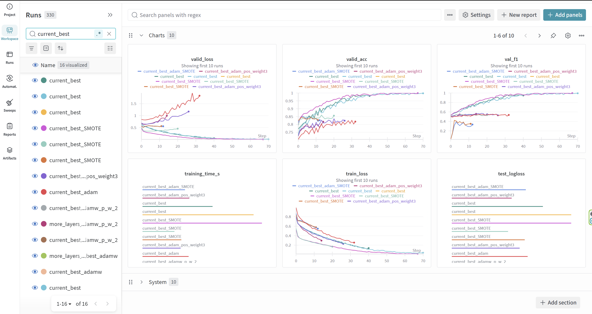

# Projekt 1
## Údaje a cieľ
- Cieľový stĺpec: `match` (binárny).
- Vstupné prvky: číselné stĺpce + vybrané kategorické stĺpce (`race`, `race_o`, `gender`, `field`).
- konečný počet bol **71**

## Predspracovanie
- Číselné: `KNNImputer(n_neighbors=5)` → `StandardScaler`.
- Kategorické:
- `race`, `race_o`, `gender`: `SimpleImputer(fill_value="missing")` → `OneHotEncoder(handle_unknown="ignore", sparse_output=False)`.
- `field`: vlastný `FieldCleaner` (malé písmená, čistenie regulárnych výrazov, mapovanie synoným) → `TargetEncoder(vyhladzovanie=50.0, handle_missing="value", handle_unknown="value")`.
- Stĺpcové prepojenie cez `ColumnTransformer` zabalený v `Pipeline`.
- Výstupy transformované na `float32`;

## Feature selection
Z každého hodnotiteľa vezmite TOP_K atribútov, potom hlasujte a zoradte podľa priemernej pozície:
- Rozptyl (jednoduchý rozptyl ako skóre).
- Vzájomná informácia (`mutual_info_classif`).
- Chi-squared (`chi2`, vyžaduje nezáporné škálovanie).
- ANOVA F-skóre (`f_classif`).

Finálna sada: funkcie s hlasmi ≥ `VOTE_THRESHOLD`; návrat k najčastejšie sa vyskytujúcim TOP_K, ak žiadny neprejde.

## Modely
- `MLPModule`: štandardný MLP s doprednou väzbou opakujúci sa `Linear → (BatchNorm) → Activation → Dropout`, finálny `Linear(..., 1)`.
- `MLPWithSkipConnections`: rovnaký zásobník na blok, ale so zvyškovými pripojeniami:
- Každý blok vypočíta `F(x)` a pridá cestu preskočenia `P(x)` (identita alebo lineárna projekcia pri zmene rozmerov), potom aktiváciu po pridaní.
- Zlepšuje tok gradientu a stabilitu na hlbších zásobníkoch.
- Strata: `BCEWithLogitsLoss`.
- Optimalizátor: typicky `Adam` a `AdamW` s weight decay.

## Tréningový plán
1. Prispôsobte preprocesor (TargetEncoder potrebuje `X` aj `y`).
2. Transformujte `X_train`, `X_val`, `X_test` na `float32`.
3. Vyberte funkcie pomocou hlasovacej schémy; v prípade potreby podľa potreby podmnožte transformované matice.
4. Inicializujte a trénujte MLP; monitorujte F1 na validačnej množine; uložte najlepší kontrolný bod.
5. Pre inferenciu použite `sigmoid` na logitové funkcie, aby ste získali pravdepodobnosti.

## Experimenty (zhrnutie)
- Bolo testované podvzorkovanie a prevzorkovanie; obe mali negatívny vplyv.
- Prevzorkovanie znížilo F1 z 0,55 na 0,45 na rovnakých dátach a nastaveniach.
- Finálne modely sú trénované na pôvodnom rozdelení triedy.
- Viacnásobné experimenty s použitím rôznych aktivačných funkcií (ReLU, Leaky ReLU, Silu,...) => Najlepšie výsledky boli ReLU
- Použitie rôznych optimalizátorov (Adam, RSMprop, AdamW, ...) => Najlepšie výsledky na Adamovi

## Changelog:

**Fáza 1 – EDA (Exploratory Data Analysis)**
V prvej fáze sme načítali dataset a vykonali úvodnú analýzu. Preskúmali sme distribúciu číselných aj kategóriálnych premenných, podiel chýbajúcich hodnôt a korelácie medzi atribútmi. Identifikovali sme irelevantné alebo redundantné stĺpce a analyzovali cieľovú premennú. Vytvorili sme prvé vizualizácie (boxploty a heatmapu) a zistili, ktoré faktory najviac zvyšujú výsledok „match“.

**Fáza 2 – Spracovanie dať a prvý model**
V druhej fáze sme aplikovali čistenie a transformáciu dát: imputáciu číselných hodnôt pomocou *KNNImputer*, škálovanie cez *StandardScaler*, kódovanie cez *OneHotEncoder* a *TargetEncoder*. Implementovali sme *ColumnTransformer* potrubie pre jednotnú predprípravu dát. Následne sme vytvorili prvý binárny klasifikačný model – MLP v PyTorch, ktorý sme trénovali na trénovacej množine s validáciou. Vyhodnotili sme základné metriky (presnosť, loss).

**Fáza 3 – Experimentovanie a vylepšenia**
V poslednej fáze sme sa sústredili na úpravu metrík(F1 skóre, confusion matrix) a experimentovanie: testovali sme rôzne architektúry MLP (vrstvy, výpadky, aktivácie), optimalizátory (Adam, RMSprop) a váhovanie skúšali pomocou *pos_weight*. Implementovali sme *GridSearch* pred hyperparametrom a zlepšili generalizáciu cez regularizáciu a výpadok. Na sledovanie výsledkov sme použili *Weights & Biases (wandb)*. Projekt bol ukončený porovnaním najlepších konfigurácií a diskusiou o vplyve jednotlivých funkcií a parametrov na výkon modelu.

## Ukážka Wandb experimentov s current_best:

