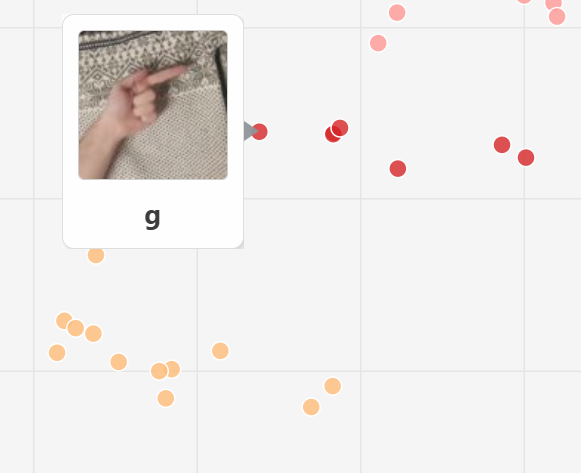
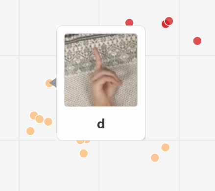
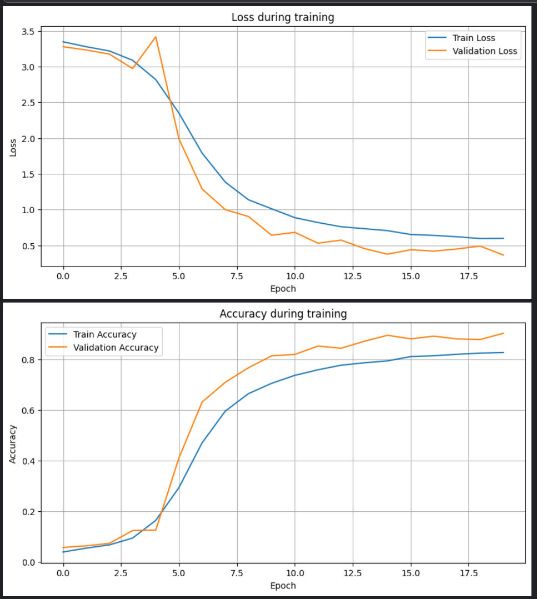
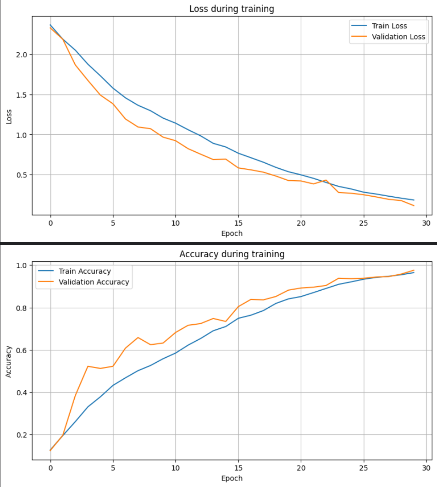

## Projekt 2

### Zadanie projektu 2:
#### ● Consultation 1 - minimal requirements:
#####    ○ Select task (google sheet maximum 2 teams per task, first come, first serve)
#####    ○ Download and examine dataset
#####    ○ Exploratory data analysis (example)
#####    ○ Select evaluation metrics
#####    ○ Preprocessing and initial augmentations

### Using dataset
> https://www.kaggle.com/datasets/kapillondhe/americansign-language

> Pracujúci na zadaní: David Vach, Krištof Kmeť, Alex Duchoň

### Základné údaje o datasete:
Dataset American Sign Language (autor Kapil Londhe) obsahuje farebné RGB snímky rúk zobrazujúcich jednotlivé písmená americkej posunkovej abecedy. Dáta sú usporiadané v adresárovej štruktúre podľa tried – každé písmeno má vlastný priečinok s príslušnými obrázkami. Dataset má veľkosť približne 5 GB a pozostáva z viac ako 160 000 snímok (165 782 súborov), čo umožňuje trénovanie aj komplexnejších hlbokých neurónových sietí. Obrazy majú konzistentné rozmery (typicky štvorcové rozlíšenie) a slúžia ako podklad pre úlohu viac-triednej klasifikácie, kde cieľovou premennou je trieda príslušného písmena abecedy.

### Vyskúšané architektúry:

- vytvorili sme vlastnú CNN sieť a na nej skúšali aj experimenty
- vyskúšali sme predtrénovanú sieť RestNet-50
- taktiež sme na porovnanie skúsili aj MobilNetV2 
### ChangeLog:

#### Week 1
V prvej fáze sme načítali dataset American Sign Language z Kaggle a vykonali úvodnú analýzu obrazových dát. Preskúmali sme rozloženie tried (jednotlivé písmená abecedy), počet snímok na triedu a celkový počet obrázkov v datasete. Skontrolovali sme rozmery obrázkov, farebné kanály (RGB) a identifikovali prípadné nekonzistencie, duplicitné alebo poškodené súbory. Dataset sme rozdelili na trénovaciu, validačnú a testovaciu množinu. Vytvorili sme prvé vizualizácie (mriežku náhodne vybraných snímok a histogram počtu obrázkov na triedu) a zistili, ktoré gestá sú v dátach najviac a najmenej zastúpené, čo naznačuje mieru triednej nevyváženosti pri ďalšom trénovaní modelu.

#### Week 2 
V druhej fáze sme navrhli a implementovali vlastnú CNN architektúru (SimpleCNN) pre klasifikáciu gest ASL – s viacerými konvolučnými vrstvami, Batch Normalization, MaxPooling, Global Average Pooling a hustými vrstvami s Dropoutom, zakončenú softmax výstupom pre 28 tried. Následne sme vyskúšali aj transfer learning s predtrénovanou sieťou ResNet-50, ktorá na validačných dátach dosahovala presnosť nad 98 %. Takto vysoká presnosť však odhalila problém v samotnom datasete: všetky snímky pochádzajú z videa jedného človeka, takže model sa naučil rozpoznávať skôr konkrétneho aktéra než všeobecné gestá. Pri reálnom testovaní na živom kamerovom vstupne preto nedokázal dobre generalizovať a veľkú časť gest nesprávne zaraďoval, často do tried B alebo C.

#### Week 3 

V tretej fáze sme vytvorili vlastný, rozmanitejší dataset. Pre 10 vybraných písmen sme najprv nahrali približne 30-sekundové videá, z ktorých sme následne extrahovali po 150 snímok na osobu (pouzivali sme na to Android aplikáciu ffmpeg, spolu sme dostali približne 450 obrázkov pre každé písmeno). Tieto dáta sme skombinovali s existujúcimi ASL datasetmi a model znovu trénovali. Nový dataset bol výrazne variabilnejší (viac ľudí, rôzne pozície ruky a pod.), vďaka čomu sa sieť neoverfittovala tak rýchlo a tréningové výsledky boli stabilnejšie a realistickejšie. Napriek tomu však RealTime klasifikácia aj pri najlepšej vlastnej CNN zostala slabá – úspešnosť v živom teste bola približne len 3–4 správne rozpoznané gestá z 10 pokusov.

Na základe EMBENDDINGU sme zisli, že CNN sa učí len na základe pozadia. Zistili sme to tak, že písmená, ktoré  by nemali byť podobné, tak boli vedľa seba a to preto, lebo ich pozadie bolo rovnaké alebo podobné.

Ukážka Wandb experimentov: 
Prvé pokusy vlastnej CNN so zmiešanými datasetmi

Tu sme skúsili menší learning rate a zväčšili Dropout na 45,9% a to zaručilo, že sa neurónová sieť  učila pomalšie a nemala výrazný OverFitting. To sme videli aj na RealTime pokuse, kde sme mali už oveľa vyššiu accurancy než predtým

